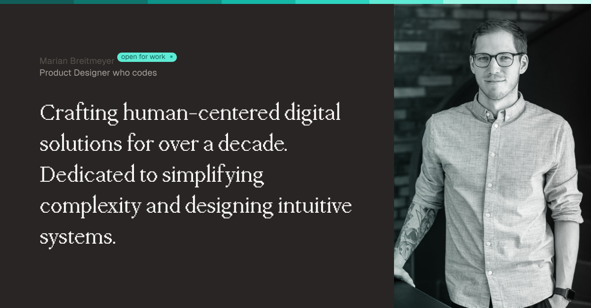

# My own little [Website MVP](https://www.marianbreitmeyer.de)

This repo features my personal website showcasing an interactive CV and providing information about myself – a digital product designer who codes.

## Stack

- NextJS & Typescript
- Tailwind CSS
- Radix UI
- Framer Motion

## Available Scripts

In the project directory, you can run:

### `npm install`

The npm install command is used to install all the dependencies defined in your project's package.json file.

### `npx run dev`

Runs the site in development mode.\
Open [http://localhost:3000](http://localhost:3000) to view it in your browser.

### `npx run build`

Create production files.
